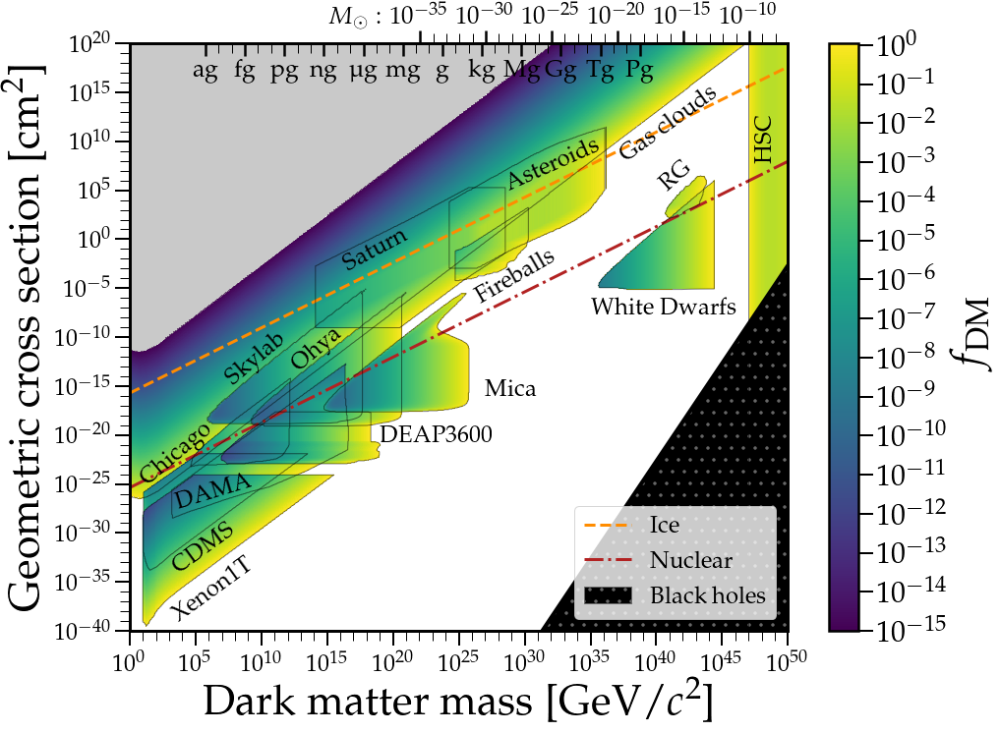
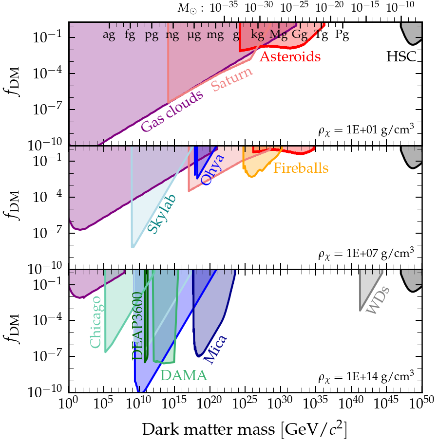

# macrolimits
## Macroscopic dark matter limits

This repository contains the code and data used to generate the results and figures in arxiv.org/abs/26xx.xxxxx. It is not intended as a living and complete collection of all constraints for macroscopic and ultraheavy dark matter, but rather as a useful resource for anyone needing to reproduce our results. More specifically, it was created with the intention of enabling constraints to be made for extended mass distributions of macroscopic dark matter.

[](https://github.com/zpicker/macrolimits/blob/main/figures/macro_constraints.png?raw=true)

[](https://github.com/zpicker/macrolimits/blob/main/figures/macro_densities.png?raw=true)

If you use something here, you can give credit by citing arxiv.org/abs/26xx.xxxxx alongside the zenodo DOI attached to this repository:
```
@misc{macrolimits,
  author       = {Zachary S. C. Picker},
  title        = {zpicker/macrolimits: Macroscopic Dark Matter Limits},
  month        = aug,
  year         = 2026,
  publisher    = {Zenodo},
  version      = {v1.0},
  doi          = {10.5281/zenodo.21892125},
  howpublished = {\url{https://github.com/zpicker/macrolimits}}
}
```
[](https://doi.org/10.5281/zenodo.21892125)


